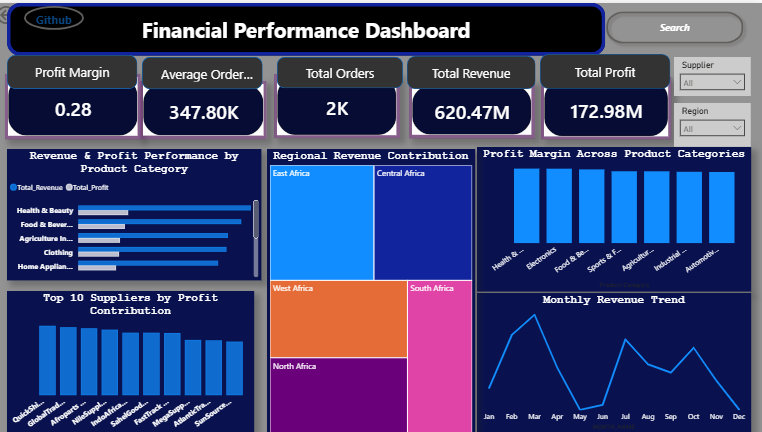
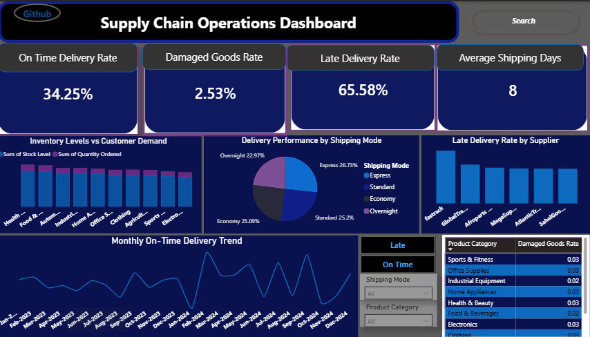

# 📦 GlobalMart Ltd. Supply Chain & Business Performance Analytics

## 🚀 End-to-End Supply Chain Analytics Project

**An interactive Power BI solution developed to monitor delivery performance, supplier efficiency, inventory management, and business profitability through data-driven insights.**

---

## 📑 Table of Contents

- [Project Overview](#-project-overview)
- [Business Problem](#-business-problem)
- [Project Objectives](#-project-objectives)
- [Dataset Overview](#-dataset-overview)
- [Data Cleaning & Preparation](#-data-cleaning--preparation)
- [KPIs Developed](#-kpis-developed)
- [Dashboard Features](#-dashboard-features)
- [Supply Chain Operations Dashboard](#-supply-chain-operations-dashboard)
- [Business Performance & Profitability Dashboard](#-business-performance--profitability-dashboard)
- [Key Business Insights](#-key-business-insights)
- [Strategic Recommendations](#-strategic-recommendations)
- [Tools & Technologies](#-tools--technologies)
- [Skills Demonstrated](#-skills-demonstrated)
- [Project Deliverables](#-project-deliverables)
- [Project Gallery](#-project-gallery)
- [Author](#-author)

---

# 📖 Project Overview

GlobalMart Ltd. is a multinational retail and distribution company operating across multiple African markets. As the business expanded, management experienced increasing delivery delays, inventory imbalance, stagnant profit margins, and limited visibility into operational performance.

This project demonstrates how **Power BI**, **Power Query**, and **DAX** can be used to transform raw operational data into interactive dashboards that provide actionable insights for executives and operations managers.

The solution focuses on improving operational efficiency, supplier performance, inventory optimization, and business profitability through data-driven decision-making.

---

# 🚨 Business Problem

GlobalMart's executive leadership identified four major operational challenges:

- 🚚 Increasing delivery delays affecting customer satisfaction.
- 📦 Inventory imbalance leading to stock shortages and overstocking.
- 💰 Flat profit margins despite growing revenue.
- 📊 Limited visibility into operational and financial performance.

---

# 🎯 Project Objectives

This project aims to:

- Identify the key drivers of delivery delays.
- Evaluate supplier performance.
- Analyze shipping mode efficiency.
- Assess inventory distribution versus customer demand.
- Measure profitability across products, suppliers, and regions.
- Develop interactive dashboards for executive decision-making.

---

# 📂 Dataset Overview

| Metric | Value |
|---------|------:|
| Total Records | **1,784** |
| Total Columns | **24** |
| Date Range | **2023 – 2024** |
| Suppliers | **13** |
| Product Categories | **10** |
| Regions | **5** |

---

# 🧹 Data Cleaning & Preparation

The dataset was cleaned and transformed in **Power Query** to ensure consistency, accuracy, and reliability for analysis.

### Cleaning Activities

- ✅ Removed duplicate records
- ✅ Corrected date formats
- ✅ Standardized data types
- ✅ Fixed decimal inconsistencies
- ✅ Handled missing values
- ✅ Corrected unit price and unit cost errors
- ✅ Corrected invalid shipping records
- ✅ Validated business logic and calculated fields

---

# 📊 KPIs Developed

## Supply Chain KPIs

- 🚚 On-Time Delivery Rate
- ⏳ Late Delivery Rate
- 📅 Average Shipping Time
- 📦 Damaged Goods Rate

## Business Performance KPIs

- 💰 Total Revenue
- 💵 Total Profit
- 📈 Profit Margin
- 📦 Total Orders
- 🛒 Average Order Value (AOV)

---

# ✨ Dashboard Features

The dashboards were designed to provide an intuitive and interactive user experience.

### Interactive Features

- 🔍 **Search-Enabled Slicer**
  - Enables users to quickly locate suppliers, regions, categories, and other data points.

- 🔘 **Bookmark Navigation**
  - Users can switch seamlessly between the **On-Time Delivery Trend** and **Late Delivery Trend** charts using interactive buttons.

- 💬 **Custom Report Tooltips**
  - Detailed report page tooltips provide additional context and KPI information when hovering over visuals.

- 🌐 **GitHub Documentation Button**
  - A navigation button links directly to the project's GitHub repository, allowing users to move between the dashboard and project documentation.

- 🎛 **Interactive Slicers**
  - Dashboard filters enable dynamic analysis across suppliers, product categories, regions, shipping modes, and time.

- 📊 **Dynamic KPI Cards**
  - KPIs update automatically based on user selections.

- 🔄 **Cross-Filtering & Cross-Highlighting**
  - Selecting one visual instantly filters and highlights related visuals across the report.

- 🗺 **Interactive Map Visual**
  - Displays regional revenue contribution and geographic business performance.

- 📅 **Calendar Table**
  - Supports accurate time intelligence and chronological trend analysis.

- ⚡ **DAX Measures**
  - Reusable DAX measures ensure consistent calculations across all visuals.

- 🎨 **Executive Dashboard Design**
  - Clean layout with intuitive navigation, consistent styling, and user-friendly visuals.

---

# 🚚 Supply Chain Operations Dashboard

## Dashboard Preview

### Dashboard KPIs

| KPI | Value |
|------|------:|
| On-Time Delivery Rate | **34.25%** |
| Late Delivery Rate | **65.58%** |
| Average Shipping Time | **8 Days** |
| Damaged Goods Rate | **2.53%** |

### Dashboard Visuals

- Supplier Delivery Delay Performance
- Delivery Performance by Shipping Mode
- Monthly Delivery Trend
- Inventory Levels vs Customer Demand
- Damaged Goods Across Product Categories

---

# 💰 Business Performance & Profitability Dashboard

## Dashboard Preview

### Dashboard KPIs

| KPI | Value |
|------|------:|
| Total Revenue | **620.47M** |
| Total Profit | **172.98M** |
| Profit Margin | **28%** |
| Total Orders | **2K** |
| Average Order Value | **347.80K** |

### Dashboard Visuals

- Revenue & Profit by Product Category
- Profit Margin Across Product Categories
- Regional Revenue Contribution
- Monthly Revenue Trend
- Top 10 Suppliers by Profit Contribution

---

# 📈 Key Business Insights

## 🚚 Delivery Performance

- FastTrack recorded the highest late delivery rate.
- Express Shipping achieved the highest on-time delivery performance.
- Average shipping time across all orders was **8 days**.
- March 2024 recorded the strongest delivery performance.
- Health & Beauty experienced the highest damaged goods rate.

---

## 💰 Profitability

- Total Revenue reached **620.47M**.
- Total Profit amounted to **172.98M**.
- Profit Margin stood at **28%**.
- East Africa generated the highest revenue.
- Health & Beauty was the most profitable product category.
- QuickShip Co. contributed the highest supplier profit.
- Revenue peaked during **February, July, and October**.

---

# 💡 Strategic Recommendations

- Improve supplier monitoring and performance management, particularly for FastTrack.
- Increase the use of Express Shipping for urgent deliveries.
- Strengthen inventory planning to minimize stock shortages and overstocking.
- Improve packaging and quality control processes to reduce damaged goods.
- Continuously monitor revenue trends to identify seasonal demand patterns.
- Use interactive dashboards for continuous operational and financial monitoring.

---

# 🛠 Tools & Technologies

- Microsoft Power BI
- Power Query
- DAX (Data Analysis Expressions)
- Data Modeling
- Data Visualization
- Microsoft Excel

---

# 🚀 Skills Demonstrated

- Data Cleaning & Transformation
- Data Modeling
- Power Query
- DAX Calculations
- Time Intelligence
- Interactive Dashboard Design
- Business Intelligence
- Supply Chain Analytics
- Business Performance Analysis
- Data Visualization
- Business Storytelling

---

# 📁 Project Deliverables

- ✅ Data Cleaning & Transformation
- ✅ KPI Development using DAX
- ✅ Supply Chain Operations Dashboard
- ✅ Business Performance Dashboard
- ✅ Executive PowerPoint Presentation

---

# 👩‍💻 Author

## **Owolabi Kaothar Pelumi**

**Data Analyst | Power BI Developer | Business Intelligence Enthusiast**

📧 Email: *your-email@example.com*

💼 LinkedIn: *https://www.linkedin.com/in/kaotharowolabi/*

---

## ⭐ If you found this project insightful, please consider giving this repository a star!